# Entrega 02

- **Nombre:** Jeremías Mena
- **`student_id`:** `jmena`

## Job
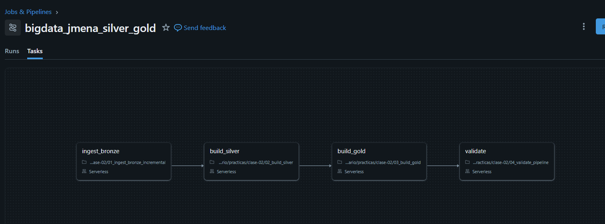

URL del job: https://dbc-56bbeb09-4d33.cloud.databricks.com/jobs/929729170742187?o=7474648327291677

Job ID: 929729170742187

## Resultados de la primera ejecución
### `build_silver`

Registros rechazados y enviados a cuarentena, agrupados por lote de origen y motivo.

| source_batch_id | quality_reason   | count |
|-----------------|------------------|------:|
| batch_002       | INVALID_AMOUNT   |     1 |
| batch_002       | UNKNOWN_CUSTOMER |     1 |
| initial         | INVALID_AMOUNT   |    51 |


Número de transacciones que superaron las validaciones y llegaron a la capa Silver.
 
| source_batch_id | count |
|-----------------|------:|
| batch_002       |   201 |
| initial         | 49948 |

### `build_gold`

Resumen por lote

| source_batch_id | accepted_transactions | rejected_transactions | total_amount | fraud_transactions |
|-----------------|----------------------:|----------------------:|-------------:|-------------------:|
| batch_002       |                   201 |                     2 |    146812.99 |                 28 |
| initial         |                 49948 |                    51 |  50139370.34 |               6560 |

### `validate`
Todos los controles automáticos pasan correctamente.
 
| control                         | passed |
|---------------------------------|--------|
| silver_no_duplicate_ids         | true   |
| gold_reconciles_rows            | true   |
| gold_reconciles_amount          | true   |
| batch_arrived_in_bronze         | true   |
| batch_arrived_in_silver         | true   |
| batch_has_controlled_rejections | true   |
| batch_is_visible_in_gold        | true   |
| historical_correction_applied   | true   |

Se ejecutó el job dos veces sobre el mismo lote (`batch_002`) para comprobar que el resultado no cambia al reprocesar.
 
| job_run_id       | expected_batch_id | silver_rows | quarantine_rows | gold_rows | gold_total_amount | idempotence_compared |
|------------------|-------------------|------------:|----------------:|----------:|------------------:|----------------------|
| 508735289211689  | batch_002         |       50149 |              53 |       598 |       50286183.33 | true                 |
| 1114417553147735 | batch_002         |       50149 |              53 |       598 |       50286183.33 | false                |
 
Ambas ejecuciones producen exactamente las mismas métricas, lo que nos confirma que el pipeline es idempotente. Esta última propiedad se puede verificar chequeando la columna `idempotence_compared`.

## Resultados de la segunda ejecución
### `build_silver`
Registros rechazados y enviados a cuarentena, agrupados por lote de origen y motivo.

| source_batch_id | quality_reason   | count |
|-----------------|------------------|------:|
| batch_002       | INVALID_AMOUNT   |     1 |
| batch_002       | UNKNOWN_CUSTOMER |     1 |
| batch_003       | INVALID_AMOUNT   |     1 |
| batch_003       | UNKNOWN_CUSTOMER |     1 |
| initial         | INVALID_AMOUNT   |    51 |


Número de transacciones que superaron las validaciones y llegaron a la capa Silver.
 
| source_batch_id | count |
|-----------------|------:|
| batch_002       |   200 |
| batch_003       |   201 |
| initial         | 49948 |

### `build_gold`

Resumen por lote

| source_batch_id | accepted_transactions | rejected_transactions | total_amount | fraud_transactions |
|-----------------|----------------------:|----------------------:|-------------:|-------------------:|
| batch_002       |                   200 |                     2 |    146812.99 |                 27 |
| batch_003       |                   201 |                     2 |    147014.99 |                 28 |
| initial         |                 49948 |                    51 |  50139370.34 |               6560 |

### `validate`
Todos los controles automáticos pasan correctamente.
 
| control                         | passed |
|---------------------------------|--------|
| silver_no_duplicate_ids         | true   |
| gold_reconciles_rows            | true   |
| gold_reconciles_amount          | true   |
| batch_arrived_in_bronze         | true   |
| batch_arrived_in_silver         | true   |
| batch_has_controlled_rejections | true   |
| batch_is_visible_in_gold        | true   |
| historical_correction_applied   | true   |

 
| job_run_id       | expected_batch_id | silver_rows | quarantine_rows | gold_rows | gold_total_amount | idempotence_compared |
|------------------|-------------------|------------:|----------------:|----------:|------------------:|----------------------|
| 114132714324517  | batch_003         |       50349 |              55 |       669 |       50431198.33 | false                |
| 508735289211689  | batch_002         |       50149 |              53 |       598 |       50286183.33 | true                 |
| 1114417553147735 | batch_002         |       50149 |              53 |       598 |       50286183.33 | false                |


## Explicación breve de porqué `COPY INTO` y `MERGE` resuelven distintos problemas

1. `COPY INTO` resuelve la ingesta de archivos: carga datos desde archivos en almacenamiento hacia una tabla. Es idempotente a nivel de archivo, es decir, lleva registro de qué archivos ya cargó y no los vuelve a procesar. Su foco es traer datos nuevos de forma eficiente y sin duplicar archivos.
2. `MERGE` resuelve la reconciliación de filas: compara una tabla destino con una fuente según una clave y decide, fila por fila, si hacer `INSERT`, `UPDATE` o `DELETE`. Su foco es mantener la tabla sincronizada con los cambios.

## Visualizaciones

### Consigna 1 — Evolución temporal
**Pregunta**: ¿Qué día tuvo el mayor monto vendido y ese día también fue el de mayor cantidad de transacciones?

**Gráfico**

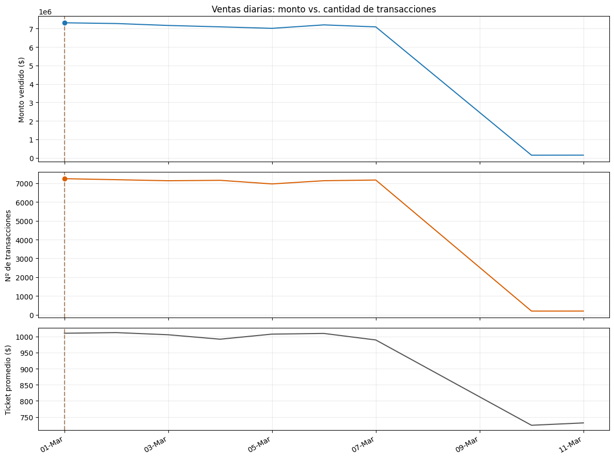

**Respuesta**

* Día de mayor monto: 2026-03-01  -> $7,310,841
* Día de más transacciones: 2026-03-01  -> 7,236
* ¿Coinciden? True
* Ticket promedio ese día (monto): $1,010.34
* Ticket promedio del período:     $1,001.63

Como el ticket promedio es: monto / transacciones, las dos métricas y el ticket están relacionados. Frente a esto, existen dos escenarios posibles:

1. Si los máximos (máx. monto y máx. transacciones) coinciden: el día de mayor facturación fue impulsado por el volumen de clientes. El ticket promedio de ese día debería estar cerca del promedio del período. El récord de ventas se explica por cantidad de clientes y no porque cada cliente gastara más.
2. Si no coinciden: el ticket promedio varió ese día, y hay dos casos:
    1. Si el día de mayor monto no tiene el mayor número de transacciones, entonces el ticket promedio de ese día estuvo por encima de lo normal. Las ventas se explican por compras más grandes.
    2. Si el día de más transacciones no tiene el mayor monto, entonces su ticket promedio fue bajo. Pasó que mucha gente compró, pero cosas baratas.

### Consigna 2 — Canal y fraude
**Pregunta**: ¿Qué canal de pago presenta la mayor tasa de fraude? ¿La conclusión se sostiene al considerar el número de transacciones de cada canal?

**Gráfico**

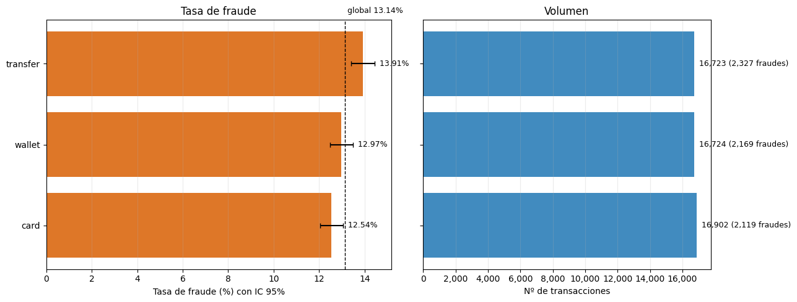

**Respuesta**

|payment_channel| fraud_transactions| transaction_count | fraud_rate_percentage |             ic95 |
|---------------|-------------------|-------------------|-----------------------|------------------|       
|      transfer |               2327|              16723|                 13.915| [13.40% – 14.45%]|
|        wallet |               2169|              16724|                 12.969| [12.47% – 13.49%]|
|          card |               2119|              16902|                 12.537| [12.05% – 13.04%]|

* Tasa global (suma/suma): 13.138%
* Mayor tasa: transfer | Segundo: wallet
* Intervalos se solapan: True
* Canal con más fraudes absolutos: transfer | ¿coincide con mayor tasa?: True

**¿Qué canal de pago presenta la mayor tasa de fraude?**

Como se puede observar en la tabla propuesta, el canal de pago que presenta la mayor tasa de fraude es transfer

**¿La conclusión se sostiene al considerar el número de transacciones de cada canal?**

El volumen no distorsiona la comparación. Los tres canales presentan una cantidad casi idéntica de transacciones, así que ninguna tasa se apoya en una muestra más chica que las otras. Los intervalos son angostos, por lo que ninguna tasa es inestable. Además, transfer también tiene más fraudes absolutos (2.327), de modo que ranking absoluto y ranking por tasa coinciden. Con volúmenes tan parejos, eso es esperable.

### Consigna 3 — Concentración geográfica y de producto
**Pregunta**: ¿Qué combinación de país y categoría genera el mayor monto? ¿Existe una categoría dominante en todos los países o cambia según el mercado?

**Gráfico**

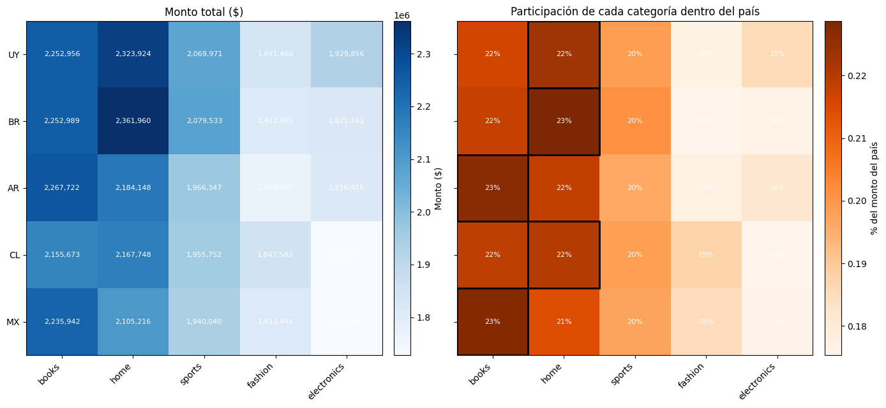

**Respuesta**

Máximo global: BR y home -> $2,361,960 (4.7% del total)

|country|categoria_dominante |monto     | participacion (%)  |
|-------|--------------------|----------|--------------------|                                         
|UY     |home                |2323924.46|               22.3 |
|BR     |home                |2361959.97|               22.9 |
|AR     |books               |2267722.26|               22.7 |
|CL     |home                |2167748.03|               22.0 |
|MX     |books               |2235941.63|               22.8 |

* Categorías distintas que lideran: 2
* Dominante global (todos los países): False

Margen 1era vs 2da categoría (pp):
|country|   |
|-------|---|
|UY     |0.7|
|BR     |1.1|
|AR     |0.8|
|CL     |0.1|
|MX     |1.3|

Para representar gráficamente esta consigna elegí el mapa de calor ya que con N países × M categorías, las barras agrupadas generan N×M barras, difíciles de leer y de comparar. En cambio, el mapa de calor muestra todas las combinaciones en una grilla compacta donde se puede detectar enseguida el máximo y los patrones por fila o columna. Además, propuse dos paneles: monto absoluto que responde "¿qué combinación es la mayor?" y participación dentro de cada país que responde "¿la categoría dominante cambia según el mercado?".

**¿Qué combinación de país y categoría genera el mayor monto?**

La combinación de país y categoría que genera el mayor monto es Brasil y home, con un monto de $2,361,960.

**¿Existe una categoría dominante en todos los países o cambia según el mercado?**

No, no existe una categoría dominante en todos los mercados: home lidera en Uruguay, Brasil y Chile, y books en Argentina y México.


### Consigna 4 — Calidad del pipeline
**Pregunta**: ¿Qué proporción de cada lote fue aceptada y rechazada? ¿El lote nuevo presenta una calidad diferente del lote inicial?

**Gráfico**

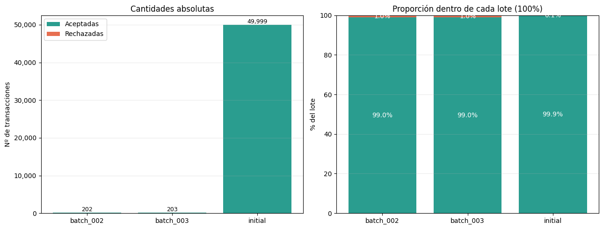

**Respuesta**

**¿Qué proporción de cada lote fue aceptada y rechazada?**

En los tres lotes la gran mayoría de las transacciones fue aceptada: 99,90% en el lote inicial y 99,01% en batch_002 y batch_003. Sin embargo, la tasa de rechazo de los lotes nuevos (~0,99%) es aproximadamente diez veces la del lote inicial (0,10%).

**¿El lote nuevo presenta una calidad diferente del lote inicial?**

Los lotes nuevos tienen una calidad peor en términos relativos, aunque el nivel de rechazo sigue siendo bajo en términos absolutos. Aunque esta conclusión se ve limitada ya que cada lote nuevo tiene solo aproximadamente 200 transacciones y 2 rechazos, por lo que la tasa real está estimada con poca precisión.


## Análisis de las tablas

1. ¿Cuántas filas físicas recibió cada lote en `bronze_transactions_incremental`? Escribí una consulta que muestre el resultado por `source_batch_id`.

    **Consulta para conocer cuántas filas físicas recibió cada lote**
    ```
    spark.table(incremental).groupBy("source_batch_id").count().orderBy("source_batch_id")
    ```

    **Resultado**
    |source_batch_id  |count  |
    |-----------------|-------|
    |batch_002        |204    |
    |batch_003        |204    |

2. Para cada lote, ¿cuántas transacciones fueron aceptadas y cuántas quedaron en `silver_transactions_quarantine`? Reconciliá tus resultados con `gold_batch_summary`.
    
    **Resultado**
    |source_batch_id  |accepted_transactions  |rejected_transactions  |
    |-----------------|-----------------------|-----------------------|
    |batch_002        |200                    |2                      |
    |batch_003        |201                    |2                      |
    |initial          |49948                  |51                     |

3. ¿Qué motivos de rechazo aparecen en la cuarentena y cuántos registros tiene cada uno por lote? ¿Los rechazos observados coinciden con los casos introducidos por el generador?

    **Resultado**
    |source_batch_id  |motivo                 |count                  |
    |-----------------|-----------------------|-----------------------|
    |batch_002        |INVALID_AMOUNT         |1                      |
    |batch_002        |UNKNOWN_CUSTOMER       |1                      |
    |batch_003        |INVALID_AMOUNT         |1                      |
    |batch_003        |UNKNOWN_CUSTOMER       |1                      |
    |initial          |INVALID_AMOUNT         |51                     |

    Sí, los rechazos observados coinciden con los registros introducidos por el generador. A continuación se muestran los resultados obtenidos de observar la tabla `quarantine`.

    **Resultado**
    |source_batch_id|customer_id|amount|quality_reason  |
    |---------------|-----------|------|----------------|
    |batch_002      |19         |N/A   |INVALID_AMOUNT  |
    |batch_002      |5999       |27.84 |UNKNOWN_CUSTOMER|
    |batch_003      |20         |N/A   |INVALID_AMOUNT  |
    |batch_002      |5999       |28.85 |UNKNOWN_CUSTOMER|

4. Seguí la transacción `42` desde `bronze_transactions_all` hasta `silver_transactions`. ¿Cuántas versiones existen en Bronze y cuál quedó vigente en Silver? Mostrá las columnas que justifican la elección.

    Dentro de la etapa Bronze existe una versión de esta transacción por cada lote. En los lotes 002 y 003, se logra apreciar que esta es una transacción fraudulenta, mientras que en el lote inicial no lo es. En la etapa Silver quedó vigente la versión del lote 003, es decir la fraudulenta. A continuación se muestran las columnas que justifican la elección.

    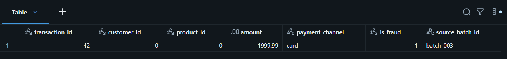

5. Comprobá mediante una consulta que `silver_transactions` tiene una sola fila por `transaction_id`. ¿Qué resultado indicaría que la deduplicación falló?

    A través de la siguiente consulta:
    ```
    spark.table(transactions).groupBy("transaction_id").count().filter(F.col("count") > 1).orderBy(F.col("count").desc())
    ```

    **Resultado**

    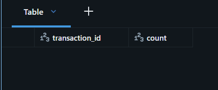

    Se logra apreciar que existen registros dentro del resultado de esta consulta, por ende podemos garantizar que todas las filas son únicas y que la deduplicación funcionó correctamente. De existir algún resultado para esta consulta, estaría demostrado que la deduplicación falló.

6. Calculá la tasa de rechazo de cada lote como `rechazadas / (aceptadas + rechazadas)` en `gold_batch_summary`. ¿Es correcto comparar solamente las cantidades absolutas si los lotes tienen tamaños diferentes?

    **Consulta**
    ```
     spark.table(batch)
        .withColumn("total", F.col("accepted_transactions") + F.col("rejected_transactions"))
        .withColumn(
          "tasa_rechazo",
          F.when(F.col("total") == 0, None)
           .otherwise(F.col("rejected_transactions") / F.col("total"))
      )
      .orderBy(F.col("tasa_rechazo").desc())
    ```

    **Resultado**

    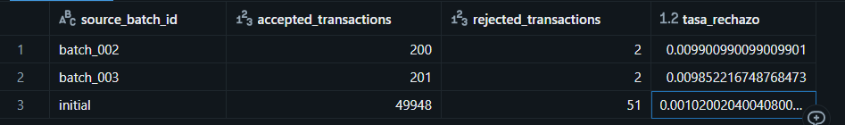

    No, comparar los lotes por cantidades absolutas no resulta del todo correcto, de hecho puede ser muy engañoso. Un lote con 500 rechazos sobre 100.000 transacciones (0,5 %) es mucho más sano que uno con 50 rechazos sobre 200 (25 %), pero en números absolutos parece al revés. En este caso, la tasa normaliza por el tamaño del lote y permite comparar de manera justa.

7. ¿Qué día presenta el mayor monto total y cuál presenta la mayor cantidad de transacciones? Consultá `gold_daily_sales` y explicá si ambos máximos coinciden.
    
    **Consulta**
    ```
    spark.table(daily)
      .groupBy("sale_date")
      .agg(
          F.sum("total_amount").alias("monto_total"),
          F.sum("transaction_count").alias("cantidad_transacciones")
      )
    ```

    **Resultado**

    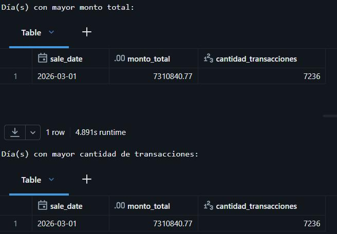

    Como se logra apreciar en el resultado obtenido, ambos máximos coinciden en el mismo día.

8. ¿Qué canal de pago tiene la mayor tasa global de fraude? Calculala como `SUM(fraud_transactions) / SUM(transaction_count)` y explicá por qué no corresponde promediar directamente `fraud_rate`.

    **Consulta**
    ```
     spark.table(daily)
    .groupBy("payment_channel")
      .agg(
          F.sum("fraud_transactions").alias("total_fraude"),
          F.sum("transaction_count").alias("total_transacciones"),
      )
      .withColumn(
          "tasa_fraude_global",
          F.col("total_fraude") / F.col("total_transacciones")
      )
      .orderBy(F.col("tasa_fraude_global").desc())
    ```

    **Resultado**

    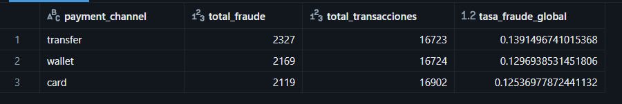

    Dentro de los resultados podemos observar que el método de pago que tiene una mayor tasa global de fraude es `wallet`. No corresponde promediar directamente `fraud_rate` debido a que esta columna es una razón (fraude/transacciones). Hacer el promedio de esta columna da el mismo peso a cada fila sin importar cuántas transacciones representa, y eso distorsiona el resultado.

9. ¿Qué combinación de país y categoría concentra el mayor monto vendido? Mostrá también la combinación líder dentro de cada país.

    **Combinación que concentra el mayor monto vendido**
    ```
    spark.table(daily)
               .groupBy("country","category")
               .agg(F.sum("total_amount").alias("monto_total"))
               .orderBy(F.col("monto_total").desc())
               .limit(1)
    ```

    **Resultado**

    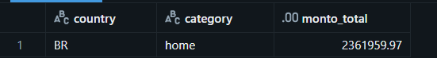

    
    **Combinación líder dentro de cada país**
    ```
    w = Window.partitionBy("country").orderBy(F.col("monto_total").desc())

    top_por_pais = (
        resultado_9
        .withColumn("rn", F.row_number().over(w))
        .filter(F.col("rn") == 1)
        .drop("rn")
        .orderBy(F.col("monto_total").desc())
    )
    ```

10. Compará las dos primeras filas de `pipeline_run_audit` correspondientes a la reejecución de `batch_002`. ¿Qué métricas permanecen iguales y qué columna demuestra que se realizó la comparación de idempotencia?

    Las métricas que permanecen iguales en ambas filas son `silver_rows`, `quarantine_rows`, `gold_rows` y `gold_total_amount`. La columna que demuestra que se realizó la comparación de idempotencia es `ìdempotence_compared`.


### Interpretación del código y del pipeline

11. En `01_ingest_bronze_incremental.ipynb`, ¿qué problema resuelve `COPY INTO` y qué información utiliza para evitar cargar dos veces el mismo archivo físico?

    El problema que resuelve `COPY INTO` es la carga de grandes volúmenes de datos provenientes de archivos externos a tablas en SQL, en lugar de hacerlo fila por fila como lo hace `INSERT INTO`. En nuestro caso, la información que utiliza para evitar cargar dos veces el mismo archivo es la ruta de este archivo y su formato.
12. ¿Por qué la vista `bronze_transactions_all` usa `UNION ALL` en lugar de eliminar duplicados? ¿En qué capa se resuelven los duplicados de negocio y por qué?

    La vista `bronze_transactions_all` utiliza `UNION ALL` en lugar de eliminar duplicados ya que dentro de esta etapa no se realizan modificaciones sobre los datos existentes, solo se los carga en formato tabular. La capa encargada de resolver los duplicados es la capa Silver y lo hace porque es justamente en esta etapa donde se limpian, validan y estandarizan los datos para que sean fiables.
13. ¿Por qué las transacciones iniciales reciben `source_batch_id='initial'` y usan `event_ts` como `updated_at`? ¿Cómo afecta eso a la corrección de la transacción `42`?

    Las transacciones iniciales reciben la etiqueta `initial` para lograr distinguirlas de los próximos lotes, ya que estas pertenecen al lote inicial, además usan `event_ts` como `updated_at`porque el lote inicial no trae un momento de actualización propio, así que se usa el momento del evento como "última vez que este dato fue válido". Esto afecta a la transacción `42` de la siguiente manera:
    
    La capa Silver decide qué versión gana de las 3 ya identificadas en dos pasos, y ambos dependen de `updated_at`:
    1. Deduplicación en `latest`: por `transaction_id`, ordena por `updated_at` descendente y luego por `source_batch_id` descendente para conservar la primera fila.
    2. `MERGE` contra `silver_transactions`: hace `UPDATE SET *` solo si `s.updated_at` > `t.updated_at`, con desigualdad estricta. Si no, no toca la fila.

    Por eso, para que la corrección de la transacción `42` ocurra, el registro de `batch_002` debe traer un `updated_at` posterior al `event_ts` original. Si es así, la fila se actualiza y el `source_batch_id` pasa de `initial` a `batch_002`.

14. En `quality_rules.py`, ¿qué ventaja ofrece `try_cast` frente a un `cast` convencional cuando llega un importe como `N/A`?

    La venta que ofrece `try_cast` es que no importa si la sesión del job tiene (o no) activado el modo ANSI, en ambos casos, cuando proceses un valor `N/A` devolverá `NULL`, evitando que el job se caiga y corte su ejecución.

15. Las reglas de calidad asignan una única `quality_reason`. ¿Qué sucede si un registro viola más de una regla y por qué importa el orden de las condiciones?

    Dada la estructura de la función que asigna una única `quality_reason`, si un registro viola más de una regla, sólo se asignará la primera que fue encontrada, dejando de lado las restantes. Esto se debe al compartamiento que tiene la anidación de tantos `when`, se logran comoportar como la estructura `CASE WHEN`. El orden es importante porque define cuál es la causa, lo que termina siendo el diagnóstico, también evita etiquetas engañosas por dependencias entre reglas, afecta al proceso de cuarentena de los datos y condiciona a las métricas resultantes.

16. Explicá cómo se construye `_record_key` y cómo se usa junto con `row_number`. ¿Qué caso cubre el hash cuando `transaction_id` no puede convertirse a un número?

    `_record_key` es una clave de identidad con dos ramas que se construye de la siguiente manera:
    1. Si `transaction_id` se pudo convertir a número, la clave es ese ID como texto.
    2. Si no se pudo (`try_cast` dio `NULL`), la clave es un hash SHA-256 de todas las columnas crudas del registro, unidas con `||`.
    Con `row_number` lo que es hace es quedarse con `_rn = 1`. Para cada clave, conserva la versión más reciente según `updated_at` (y `source_batch_id` como desempate). Con IDs válidos, esto es lo que hace que la corrección de una transacción reemplace a la original.

    Sin el hash, la clave sería `NULL` para todo registro con `transaction_id` inválido. Y `partitionBy` agrupa todos los nulos en una sola partición. El resultado sería que, de todos los registros con ID inválido, `row_number` dejaría solo uno y el resto desaparecería sin pasar por la cuarentena.

    Con el hash, cada registro inválido distinto forma su propia partición, así que todos llegan a la cuarentena con `INVALID_TRANSACTION_ID`. Si dos filas inválidas son idénticas en todas las columnas, colapsan en una.

17. Interpretá las dos cláusulas principales del `MERGE` de `silver_transactions`. ¿Cuándo se actualiza una fila existente y cuándo se inserta una nueva?

    Una fila existente se actualiza cuando se cumplió con la cláusula `MATCHED` (coinciden los registros) y con la siguiente condición: `s.updated_at > t.updated_at`, la cual indica que la versión de origen es más reciente. Si cumple la condición `NOT MATCHED` se realiza la inserción.

18. ¿Por qué las tablas Gold se reconstruyen completamente en esta práctica mientras Silver se actualiza con `MERGE`? Mencioná una ventaja y una limitación de cada estrategia.

    Las tablas Gold se reconstruyen completamente para que cada reejecución sea determinista. 

    Silver con `MERGE`:
    1. **Ventaja**: solo escribe lo nuevo o corregido. Es idempotente y conserva las filas existentes.
    2. **Limitación**: depende de que la clave y el `updated_at` sean confiables. Si una corrección llega con un `updated_at` igual o menor, se descarta en silencio. Además, no propaga borrados.
    
    Gold con reconstrucción total
    1. **Ventaja**: es simple y determinista. El resultado siempre refleja el estado actual de Silver, sin arrastrar errores acumulados, y absorbe las correcciones automáticamente.
    2. **Limitación**: el costo crece con el tamaño total de Silver, porque cada ejecución relee y recalcula todo aunque solo haya llegado un lote pequeño. Con volúmenes grandes habría que pasar a agregación incremental o a vistas materializadas.

19. ¿Por qué `expected_batch_id` no participa en la detección del archivo nuevo? Indicá qué parte del pipeline descubre `batch_003` y qué parte utiliza el parámetro.

    `expected_batch_id` no participa en la detección del archivo nuevo, ya que forma parte de la comprobación de que el lote esperado llegó. Si el parámetro filtrara la carga, un archivo inesperado quedaría sin ingerir, y el pipeline dependería de que alguien acierte el nombre del lote. La parte del pipeline que descubre `batch_003` es la sentencia `COPY INTO` y quienes lo utilizan son las capas Silver y Gold.

20. Si la tarea `build_silver` falla, ¿qué ocurre con `build_gold` y `validate` en el Job? Explicá cómo las dependencias del DAG evitan publicar o validar resultados incompletos.
    Si la tarea `build_silver` falla, automáticante se interrumple el job, de forma que `build_gold` y `validate` no se ejecutan hasta tanto de se repare el error en `build_silver`. 
    1. La falla se corta en el punto donde ocurre. `01_ingest_bronze_incremental` tiene un `assert` que exige que exista el `expected_batch_id` en la tabla incremental. Si el lote esperado no llegó, la tarea falla, y Silver y Gold no corren. Gold conserva su versión anterior, que sigue siendo consistente, porque `CREATE OR REPLACE TABLE` es atómico.
    2. El orden asegura que las entradas estén completas. Cada capa necesita que la anterior haya terminado de escribir:
        * Silver lee `bronze_transactions_all`, que depende de que `COPY INTO` haya cargado todo.
        * `gold_batch_summary` cruza `silver_transactions` con la cuarentena. Si corriera antes de que la cuarentena se escribiera, los rechazados saldrían como 0. En el notebook 02, ambos `MERGE` están en la misma tarea, así que Gold arranca cuando los dos terminaron.
    3. Los `assert` de cada tarea refuerzan la dependencia. Gold verifica que existan `silver_transactions`, `silver_customers`, `silver_products` y la cuarentena; Silver verifica `bronze_transactions_all`. Sirven para fallar con un mensaje claro si alguien ejecuta una tarea suelta.
